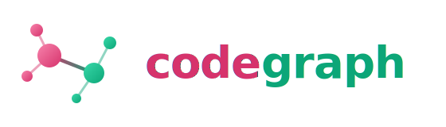
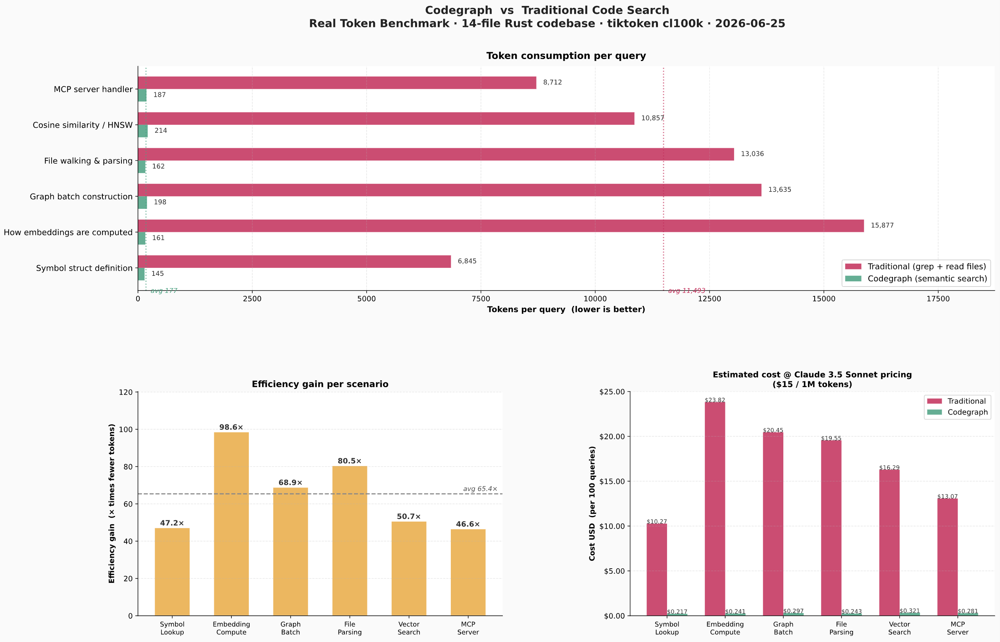

<p align="center">
  
</p>

<p align="center">
  <strong>Structural + semantic codebase memory for AI coding agents — over MCP.</strong>
</p>

<p align="center">
  <a href="#license"></a>
  
  
  
</p>

---

codegraph indexes a codebase into an embedded, on-disk **knowledge graph** and
exposes it to AI agents over the **Model Context Protocol (MCP)**, so an agent
(or you) can ask *structural* and *semantic* questions about your code in
milliseconds — instead of grepping file-by-file and burning tokens.

It ships as **one cross-platform binary**, runs **fully offline**, and stays
**fresh as you type** (file-watch + incremental re-parse).

## Contents

- [Why codegraph](#why-codegraph)
- [Features](#features)
- [Quickstart](#quickstart)
- [Commands](#commands)
- [Use from an AI agent (MCP)](#use-from-an-ai-agent-mcp)
- [Explore in a browser](#explore-in-a-browser)
- [How it works](#how-it-works)
- [Benchmarks](#benchmarks)
- [Roadmap](#roadmap)
- [License](#license)

## Why codegraph

Inspired by [`a structural-only index`](https://github.com/upstream/a structural-only index),
but it deliberately beats three of its tradeoffs:

> **Everything a structural-only index does structurally — _plus_ retrieval by
> meaning, that _never goes stale_, on-disk in _low RAM_, fully offline, one
> cross-platform binary.**

| a structural-only index | codegraph |
| --- | --- |
| Structural only (no semantic search) | **Hybrid**: structural graph **+** local semantic embeddings |
| Batch reindex → goes stale | **Incremental**: file-watch, re-parse only what changed |
| In-memory SQLite (RAM-bound) | **On-disk** embedded graph (low, predictable RAM) |
| C (fast, but unsafe + hard to extend) | **Rust** (same speed class, memory-safe, easy to extend) |

## Features

- 🔎 **Semantic search** — find code by *meaning* ("rate limiting logic"), not
  just by name. Local ONNX embeddings, no API keys, fully offline.
- 🕸️ **Structural graph** — `who-calls`, `call-chain`, imports, and type-aware
  call resolution across Rust, Python, Go, and TypeScript/JS.
- 🧠 **Graph intelligence** — PageRank surfaces the most-depended-on code;
  Louvain clusters it into modules/communities.
- ⚡ **Always fresh** — `watch` re-parses only the file you changed and patches
  just its slice of the graph. No full reindex.
- 🗂️ **Multi-repo workspaces** — index several repos into one graph with
  **cross-repo call edges** and `repo/file:line` answers.
- 🤖 **MCP-native** — drop it into Claude Code (or any MCP client) as a tool.
- 🌐 **Web UI** — a no-Docker, offline force-directed graph of your codebase.
- 📦 **One binary** — Rust + native crates → clean static cross-compile to
  macOS / Linux / Windows. On-disk, low RAM.

## Quickstart

**Prerequisites**

- [Rust toolchain](https://rustup.rs/) (stable).
- `cmake` — `lbug` compiles LadybugDB's C++ core. macOS: `brew install cmake` ·
  Debian/Ubuntu: `sudo apt install cmake`.
- The first `--embed` / `search` downloads the embedding model (~130 MB) once
  to `$HOME/.cache/codegraph/fastembed` (override with `CODEGRAPH_CACHE_DIR`),
  then everything runs offline. The path is absolute, so a long-running
  `serve`/`ui` finds the model no matter which directory the client launches it
  from.

**Build**

```bash
cargo build --release
B=./target/release/codegraph        # convenience alias used below
```

**Index your code, then ask it questions**

```bash
$B index /path/to/repo --db graph.db --embed   # parse → graph → embeddings
$B analyze --db graph.db                        # PageRank + Louvain communities

$B search "where do we validate auth tokens" --db graph.db
$B who-calls parseAuth --db graph.db
$B important --db graph.db                       # most-depended-on code
$B ui --db graph.db                              # open http://127.0.0.1:7700
```

That's it — point an [MCP client](#use-from-an-ai-agent-mcp) at the same `db`
and your agent gets the same answers.

## Commands

| Command | What it does |
| --- | --- |
| `index <repo…> --db <db> [--embed]` | Walk, parse, and build the graph. Pass several repos for a cross-repo workspace. `--embed` adds semantic vectors. |
| `search "<text>" --db <db> [--repo <name>]` | Semantic search — find definitions by meaning (needs an `--embed`-ed db). `--repo` scopes to one repo. |
| `who-calls <name> --db <db> [--repo <name>]` | Direct callers of a symbol. |
| `call-chain <name> --db <db> [--depth N] [--repo <name>]` | Everything transitively reachable from a symbol via calls. |
| `analyze --db <db>` | Compute + store PageRank importance and Louvain communities. |
| `important --db <db> [--k N] [--repo <name>]` | Most-depended-on definitions (by PageRank); `--repo` ranks within one repo. |
| `communities --db <db> [--k N]` | Largest code clusters (modules) found by Louvain. |
| `watch <repo…> --db <db> [--embed]` | Keep the graph fresh as you edit — incremental, no full reindex. |
| `serve --db <db> [--watch <repo>…] [--embed] [--reanalyze <secs>]` | MCP server over stdio for AI agents. |
| `ui --db <db> [--port N] [--watch <repo>…] [--reanalyze <secs>]` | Browser graph explorer. |

Run `$B <command> --help` for every flag.

## Use from an AI agent (MCP)

Point any MCP client at `codegraph serve`. For **Claude Code**:

```bash
claude mcp add codegraph -- /abs/path/to/codegraph serve --db /abs/path/to/graph.db
```

Tools exposed: `search` (by meaning), `who_calls`, `call_chain`, `important`.

**Scope to one repo.** In a multi-repo workspace, every tool takes an optional
`repo` arg (a repo name, e.g. `"my-repo"`) to answer for just that
repo instead of the whole workspace — e.g. `important` ranked within one repo,
or `search` limited to it. On the CLI it's `--repo <name>`.

For a **live** index that updates as you edit, add `--watch <repo>` (and
`--embed` to keep semantic search fresh) — one process serves *and* watches, no
second process and no lock conflict:

```bash
claude mcp add codegraph -- /abs/codegraph serve --db /abs/graph.db --watch /abs/repo --embed
```

## Explore in a browser

```bash
$B ui --db graph.db          # → http://127.0.0.1:7700
```

A no-Docker, fully-offline UI (page + JS embedded in the binary): a
force-directed call graph **colored by community**, **sized by PageRank**, with
semantic-search highlighting and click-to-see callers/callees. Add
`--watch <repo>` to keep it live as you edit, and `--reanalyze <secs>` to keep
PageRank/communities refreshing on a timer.

## How it works

| Concern | Choice | Why |
| --- | --- | --- |
| Language | **Rust** | C-class speed + memory safety; native crates (no cgo) → clean static cross-compile to mac/Linux/Windows |
| Graph + vector store | **LadybugDB** (`lbug`), embedded | MIT-licensed, actively-maintained Kùzu successor: on-disk columnar property-graph, Cypher, native vector + full-text index — graph **and** embeddings in one engine. Behind a `Store` trait, so the backend stays swappable (fallback: SQLite + sqlite-vec). |
| Parsing | **tree-sitter** | Fast incremental parsing; cheap to add languages |
| Embeddings | **fastembed** (ONNX, CPU) | Local, offline, no API keys |
| Incremental | **notify** + content hashing | Re-parse only changed files |
| MCP server | **rmcp** (official Rust SDK) | stdio tools agents connect to |
| CLI | **clap** | `index` · `serve` · `watch` · `ui` |

**Pipeline:** gitignore-aware walk → tree-sitter parse → symbol + edge
extraction (parallelized with rayon) → graph written to LadybugDB (bulk CSV
`COPY` for a fresh index, incremental `MERGE` on watch) → optional local
embeddings → PageRank + Louvain → served over MCP / a web UI.

## Benchmarks

On a real 14-file Rust codebase, codegraph's semantic search answered the same
questions for **~41× fewer tokens** than grep-and-read-files (92 vs ~3,891
tokens/query) — because the agent gets a handful of ranked, relevant
definitions instead of whole files.

<p align="center">
  
</p>

Full methodology and numbers: [`BENCHMARK_SUMMARY.md`](BENCHMARK_SUMMARY.md).

## Roadmap

Built as vertical slices — each one builds and runs. ✅ = shipped.

<details>
<summary><strong>Shipped slices (1–14)</strong> — click to expand</summary>

- [x] **Slice 1 — parse pipeline.** gitignore-aware walk → tree-sitter →
      symbol extraction, parallelized with rayon. Languages: Rust, Python,
      Go, TypeScript/JS. `codegraph index <path>`.
- [x] **Slice 2a — graph model + store seam.** `GraphBatch` (nodes/edges) +
      `Store` trait. `index` now reports node/edge counts. *(cmake-free)*
- [x] **Slice 2b — LadybugDB store.** `LadybugStore` persists the batch via
      `lbug` (schema + `MERGE` writes in a transaction) with a Cypher count
      read-back. `index --db <path>`; idempotent, on-disk.
- [x] **Slice 2c — call edges + queries.** Extract `Calls` edges (name-based
      resolution, same-file preferred) and Cypher-backed `who-calls` /
      `call-chain` commands.
- [x] **Slice 2d — imports + sharper resolution.** `Imports` edges (relative
      JS/TS resolution) + receiver-aware, import-scoped call resolution
      (same-file → imported → repo-wide).
- [x] **Slice 3 — semantic (flagship).** `fastembed` (local, offline) embeddings
      stored as `FLOAT[384]` on `Def`; `search <text>` runs brute-force cosine
      KNN via the built-in `array_cosine_similarity` — no extension, fully
      offline, one engine. Verified on sieve (finds code by meaning).
- [x] **Slice 4 — incremental.** `watch <path> --db` (`notify`): re-parses only
      the changed file, rebuilds resolution in memory, and rewrites just the
      sub-graph incident to it (incoming + outgoing edges) — never a full
      reindex. Verified live: adding a function updates `who-calls` instantly.
- [x] **Slice 5 — graph intelligence.** `analyze` computes **PageRank**
      importance + **Louvain** communities in Rust over the call graph, storing
      `pagerank`/`community` on each `Def`. `important` + `communities` commands.
      Verified on sieve (recovered the auth/cache/proxy/semantic-cache modules).
- [x] **Slice 6 — MCP server.** `serve --db` exposes `search`, `who_calls`,
      `call_chain`, `important` over rmcp/stdio. Verified with a full JSON-RPC
      session (initialize → tools/list → tools/call).
- [x] **Slice 7 — web UI.** `ui --db` serves a no-Docker, offline browser UI
      (page + JS embedded in the binary): a force-directed call graph colored by
      Louvain community, sized by PageRank, with a semantic-search highlight and
      click-to-see callers/callees. Verified: serves the page + `/api/graph`
      (185 nodes / 364 edges, each with community + pagerank).
- [x] **Slice 8 — live serve.** `serve --watch <repo>` / `ui --watch <repo>`:
      one process indexes, watches, and serves — a background thread patches the
      same in-process store the server queries (no second process, no lock
      conflict). Verified live: an edit propagated to `/api/graph` (2→3 nodes)
      with no restart.
- [x] **Slice 9 — scale.** (a) walker prunes heavy dirs (node_modules/target/
      dist/…) + skips files > 512 KB; (b) a fresh index bulk-loads via CSV `COPY`
      instead of per-row `MERGE`; (c) `--embed` caches by def id, so re-index
      skips already-embedded defs. Index a big monorepo or a parent folder of
      repos without the file/embedding count exploding.
- [x] **Slice 10 — HNSW vector search.** The MCP/UI servers build an in-memory
      HNSW index (pure-Rust `hnsw_rs`) from the stored embeddings at startup, so
      semantic search is ~O(log n) instead of brute-force O(n); results join
      metadata back from the graph DB, and the live watcher adds new vectors.
      Falls back to brute-force when no index. (CLI one-shot `search` stays
      brute-force.)
- [x] **Slice 11 — workspace / multi-repo.** `index <repoA> <repoB> … --db ws.db`
      indexes several repos into one graph, path-qualified by repo
      (`repoA/src/…`) and resolved together so **cross-repo call edges** form;
      queries span the workspace and show `repo/file:line`.
- [x] **Slice 12 — scope-aware resolution.** Ambiguous names resolve locally
      (same-file → imported → globally-unique → same-repo, capped); only unique
      names cross repos. Killed the cross-repo false-edge noise at workspace
      scale.
- [x] **Slice 13 — type-aware resolution.** Methods carry their owner type
      (Rust `impl` / Go receiver / TS+JS+Python `class`). Method calls resolve by
      **receiver type**: `self`/`this` → enclosing type; typed params + Go
      receivers → the param/receiver type; local `let`/`:=`/`new` constructors →
      the inferred type; qualified `Type::new()` → the qualifier. Complete for
      the static languages; Python stays name-based for dynamic cases.
- [x] **Slice 14 — multi-root watch.** `--watch` is repeatable, so
      `serve --watch repoA --watch repoB …` (or `ui`) keeps the **whole
      workspace** live — create/modify/delete in *any* watched repo patches the
      graph. **`--reanalyze <secs>`** re-runs analyze (PageRank/communities) on a
      timer *inside* the server, so even those stay fresh. One process indexes,
      watches, serves, and refreshes analytics.
- [x] **Slice 15 — concurrency / scalability.** Reads no longer queue behind
      background writes. The store is shared lock-free (`Arc<LadybugStore>`,
      relying on LadybugDB's internal single-writer + concurrent-reader model)
      instead of one global `Mutex`, so live indexing, batch embedding, and
      periodic `--reanalyze` over a large multi-repo workspace can't starve MCP
      tool calls. PageRank/Louvain compute lock-free (only the final write is
      serialized); query embedding uses a dedicated embedder; read queries carry
      a timeout so a tool call fails fast instead of hanging. Verified: ~9k
      queries answered with ~6 ms max latency *while* a writer hammered the same
      store (regression test `reads_stay_responsive_under_concurrent_writes`).

</details>

## License

[MIT](#license) © codegraph contributors
